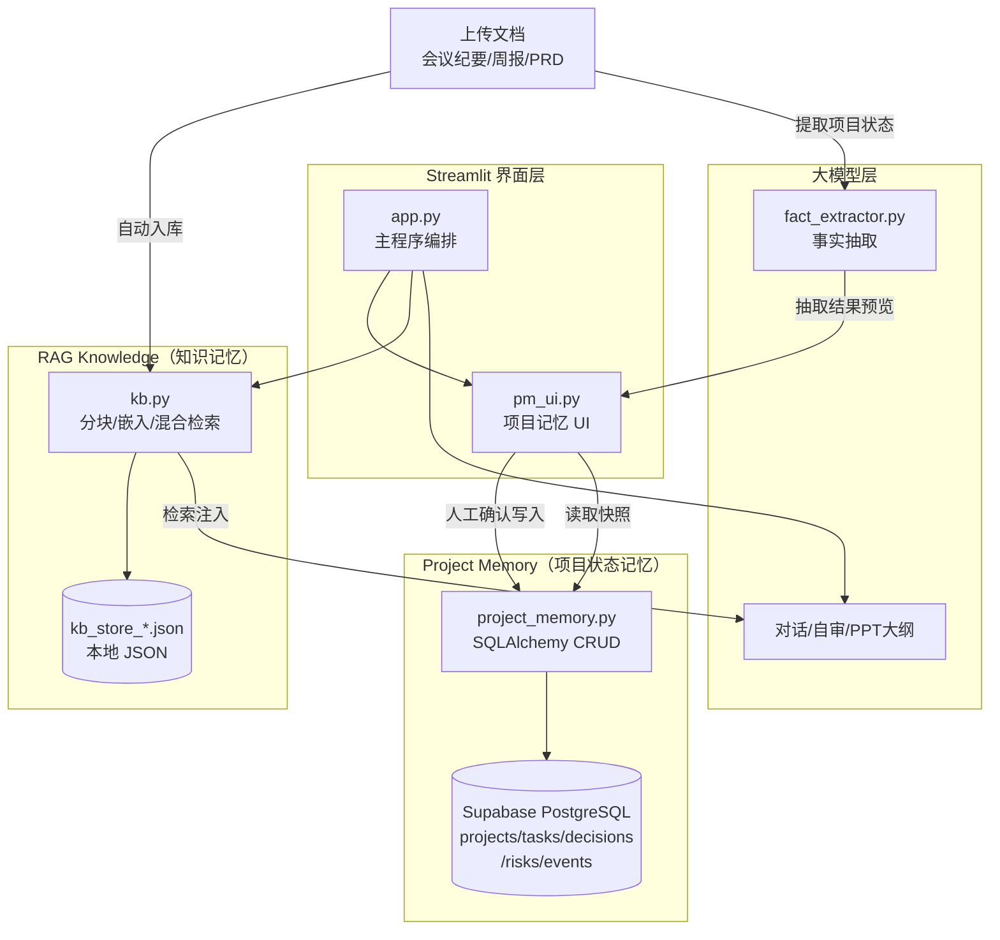
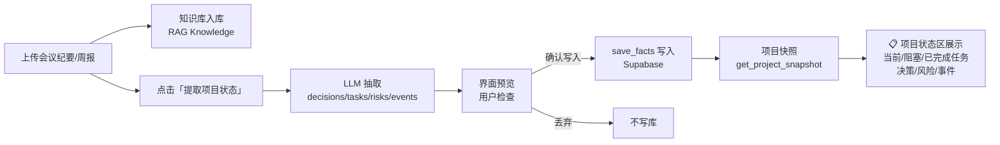

# PM_Assistant (PM Assistant)

<div align="center">

[](https://pmassistant-yej3kuxf7zqygt6bdcrt54.streamlit.app/)

**面向产品经理日常工作场景（方案撰写/需求分析/PPT 产出/文档编辑）设计的 AI 工作台**
*验证从低代码到 AI 编程的产品交付闭环*

[在线体验 Demo](https://pmassistant-yej3kuxf7zqygt6bdcrt54.streamlit.app/) · [快速开始](#快速开始) · [功能特性](#功能特性)

</div>

---

> ⚠️ **安全边界**：公网 Demo 仅用于演示，**请勿上传真实政务 / 敏感数据**。本项目知识库与项目记忆会经 LLM 及云数据库处理，不具备涉密 / 等保密级环境的保密能力。

---

## 🌟 技术亮点

🔀 **混合检索**：Embedding 向量 + BM25 关键词 → RRF 融合 → Rerank 重排，四层漏斗保障召回质量
🧠 **Project Memory**：LLM 从会议纪要/周报抽取结构化事实（决策/任务/风险/事件），人工确认后写入 Supabase PostgreSQL，项目状态跨会话持久化
🛡️ **Agent 自审**：与当前对话模型错开的 Reviewer 做五维度质量审查（准确性/完整性/来源/合规/逻辑），DeepSeek↔通义千问互审，人机协同闭环
📝 **自然语言编辑文档**：LLM 生成 patch → 增量应用，永远输出副本不覆盖源文件，带 SmartArt/修订标记边界检测
🎨 **模板化 PPT 生成**：复制模板页保留视觉设计，AI 提炼大纲后按特征填充，含演讲备注

---

## 🧠 双记忆架构：RAG Knowledge vs Project Memory

本项目的核心设计是**两套职责完全不同的记忆系统**，这是本版本最大的产品升级：

| 维度 | 📚 RAG Knowledge（知识库） | 🧠 Project Memory（项目记忆） |
|------|---------------------------|------------------------------|
| **保存什么** | 原始文档知识与证据（PRD、规范、调研资料原文） | 当前项目状态与结构化事实（决策/任务/风险/事件） |
| **数据形态** | 非结构化文本分块 + 向量 | 结构化关系型数据（5 张表） |
| **回答什么问题** | "规范里 SM4 的要求是什么？"（知识查询） | "项目现在卡在哪？上周定了什么？"（状态查询） |
| **存储位置** | 本地 JSON（`kb_store_*.json`） | Supabase PostgreSQL（云端） |
| **写入方式** | 上传文档自动入库 | LLM 抽取 → **人工确认** → 入库 |
| **读取方式** | 向量+BM25 混合检索注入对话上下文 | 项目快照（当前/阻塞/已完成任务、决策、风险、事件） |
| **模块** | `kb.py` | `project_memory.py` + `fact_extractor.py` + `pm_ui.py` |

**一句话总结**：RAG Knowledge 让助手"知道更多"，Project Memory 让助手"记得项目进展"。

---

## ✨ 功能特性

### 💬 多助手对话
- **多助手切换**：支持"产品经理助手"、"药监局项目助手"等，可在 `prompts/` 下添加 `.md` 自定义
- **多模型支持**：无缝切换 OpenAI、DeepSeek、DashScope 通义千问、本地 Ollama
- **多轮上下文**：自动截断历史对话（默认 10 轮 / 8000 字符），避免 Token 超限
- **独立会话**：各助手独立话题、独立知识库、独立存储，互不干扰

### 📚 知识库 RAG
- **多格式支持**：txt / md / pdf / docx / pptx / xlsx
- **智能分块**：结构感知分块，按 Markdown 标题、章节、段落智能切分
- **混合检索**：向量语义检索 + BM25 关键词检索 → RRF 融合 → Rerank 精排
- **独立存储**：每个助手拥有独立的知识库存储文件

### 🧠 项目状态记忆（Project Memory）
- **事实抽取**：上传会议纪要/周报后，LLM 自动抽取决策、任务、风险、事件四类结构化事实
- **人工确认入库**：抽取结果先在界面预览检查，用户确认后才写入 Supabase，杜绝误入库
- **项目快照**：随时查看当前任务、阻塞任务、已完成任务、最新决策、未关闭风险、最近事件
- **云端持久化**：Supabase PostgreSQL 存储，项目状态跨会话、跨设备不丢失
- **异常降级**：数据库不可用时仅提示错误，聊天与 RAG 功能完全不受影响

### 📊 文档产出
- **生成 PPT**：将对话内容自动提炼为演示大纲（封面/章节/内容/结尾），套用模板生成 `.pptx`
- **修改 PPT**：上传现有 PPT，通过自然语言指令增量修改（文本替换、页面增删等），永不覆盖源文件
- **生成 Word**：结构化输出 `.docx`，含标题样式、列表、页眉页脚、页码（支持中文字体）
- **修改 Word**：上传现有 DOCX，自然语言增量编辑，只输出副本

### 🛡️ 安全与边界
- **路由判定**：上传已有 `.pptx`/`.docx` 强制走编辑链路，避免误重建
- **边界检测**：PPT 含 SmartArt/动画、DOCX 含修订标记/复杂域时提前警告
- **副本安全**：所有编辑操作只输出副本，永不覆盖源文件
- **自审机制**：每次回复后用对立模型（DeepSeek↔通义千问）互审，低分自动重生成一次，确保输出质量

---

## 📁 目录结构

```
PM_assident/
├── app.py                 # Streamlit 主程序 (Web UI + 对话逻辑)
├── kb.py                  # 知识库引擎 (分块/向量化/混合检索/Rerank)
├── skill_router.py        # 路由判定层 (生成链路 vs 编辑链路)
├── project_memory.py      # 项目记忆数据库层 (SQLAlchemy + Supabase, 5 张表 CRUD)
├── fact_extractor.py      # 事实抽取器 (LLM 抽取决策/任务/风险/事件 + 写入)
├── pm_ui.py               # 项目记忆 UI 层 (侧边栏/预览确认/项目快照)
├── test_project_memory.py # Project Memory MVP 闭环测试脚本
├── pm_agent.py            # CLI 版工具 (已弃用，保留命令行能力)
├── requirements.txt       # Python 依赖清单
├── .env.example           # 密钥配置模板
├── README.md
│
├── prompts/               # 助手提示词目录
│   ├── reviewer.md        #   审查员提示词 (Agent 自审)
│   ├── 产品经理助手.md    #   产品经理助手 System Prompt
│   └── 药监局项目助手.md  #   药监局项目助手 System Prompt
│
├── sql/
│   └── init_project_memory.sql  # 数据库初始化 SQL (5 张表 + 索引)
│
├── assets/                # 静态资源
│   ├── penguin.jpg        #   企鹅形象 (UI 主题)
│   └── me.pptx            #   PPT 模板 (视觉设计来源)
│
├── styles/
│   └── app.css            # 主题样式 (企鹅奶油风)
│
├── hands_on_deck/         # PPT 增量编辑引擎
│   │                      #   (fork 自 EveryInc/hands-on-deck)
│   ├── scripts_deck.py    #   核心 CLI (deck.py)
│   ├── inventory.py       #   模块清单
│   ├── replace.py         #   文本替换
│   ├── rearrange.py       #   页面重排
│   ├── merge_decks.py     #   PPT 合并
│   ├── thumbnail.py       #   缩略图生成
│   ├── html2patch.py      #   HTML 转 patch
│   └── SKILL.md
│
└── .streamlit/config.toml # Streamlit 配置
```

---

## 🏗️ 架构图



### Project Memory 数据流



**关键设计：抽取 ≠ 写库**。LLM 抽取结果先存入会话状态展示给用户，只有点击「确认写入项目记忆」才真正写入数据库，保证数据质量。

---

## 🚀 快速开始

### 1. 环境要求

- Python 3.9+
- pip

### 2. 安装依赖

```bash
pip install -r requirements.txt
```

### 3. 配置密钥

```bash
cp .env.example .env
# 编辑 .env 文件，填入以下配置：
```

**必配项（对话功能）：**
```bash
OPENAI_API_KEY=your_api_key
OPENAI_BASE_URL=https://api.deepseek.com/v1  # 或其他兼容接口
MODEL_NAME=deepseek-chat
```

**必配项（知识库 RAG）：**
```bash
EMBEDDING_API_KEY=your_embedding_api_key
EMBEDDING_BASE_URL=https://dashscope.aliyuncs.com/compatible-mode/v1
EMBEDDING_MODEL=text-embedding-v3
```

**可选：Rerank 精排（智谱）**
```bash
RERANK_API_KEY=你的智谱密钥
RERANK_MODEL=rerank
```

**可选：Project Memory（Supabase PostgreSQL）**
```bash
# 方式A：完整连接串（推荐，Supabase 后台 → Project Settings → Database → Connection string）
DATABASE_URL=postgresql://postgres.项目ID:密码@aws-0-区域.pooler.supabase.com:6543/postgres

# 方式B：分项配置
DB_HOST=db.你的项目ID.supabase.co
DB_PORT=5432
DB_NAME=postgres
DB_USER=postgres
DB_PASSWORD=你的数据库密码
```

> 未配置数据库时，项目记忆功能自动禁用（侧边栏提示），聊天与知识库不受影响。
> 首次使用需在 Supabase SQL Editor 执行 `sql/init_project_memory.sql` 创建 5 张表。

### 4. 启动应用

```bash
python -m streamlit run app.py --server.headless true --browser.gatherUsageStats false
```

浏览器访问 `http://localhost:8501` 即可。

---

## 🖼️ 功能截图

| 对话界面 | PPT 生成效果 |
|---------|-------------|
|  |  |

| Agent 自审 | 知识库检索 |
|------------|-----------|
|  |  |

*（截图待补充，可使用 Streamlit 的"导出 PNG"功能截取）*

---

## 📝 新增助手

在 `prompts/` 目录下创建 `.md` 文件，文件名即为助手名称。文件内容为 System Prompt，可在末尾用以下格式内嵌开场白：

```markdown
# 你是一名 XXX 助手...

<!--GREETING
你好，我是 XXX 助手 🐧
请描述你的需求...
GREETING-->
```

重启应用后，侧边栏会自动出现新助手。

---

## ☁️ 部署到 Streamlit Cloud

### 1. 推送代码到 GitHub

```bash
git init
git add .
git commit -m "init PM_assident"
git remote add origin https://github.com/your_username/PM_assident.git
git push -u origin main
```

### 2. 在 Streamlit Cloud 创建应用

1. 访问 [share.streamlit.io](https://share.streamlit.io/)
2. 点击 "New app" → "From existing repo"
3. 选择你的 GitHub 仓库
4. 分支选 `main`，主路径选 `app.py`

### 3. 配置 Secrets（替代 .env）

进入应用的 **Settings → Secrets**，配置以下变量（与 `.env` 文件变量名一致）：

```toml
OPENAI_API_KEY = "your_api_key"
OPENAI_BASE_URL = "https://api.deepseek.com/v1"
MODEL_NAME = "deepseek-chat"

EMBEDDING_API_KEY = "your_embedding_api_key"
EMBEDDING_BASE_URL = "https://dashscope.aliyuncs.com/compatible-mode/v1"
EMBEDDING_MODEL = "text-embedding-v3"

# 可选（Rerank 精排，智谱）
RERANK_API_KEY = "你的智谱密钥"
RERANK_MODEL = "rerank"

# 可选（Project Memory，Supabase）
DATABASE_URL = "postgresql://postgres.项目ID:密码@aws-0-区域.pooler.supabase.com:6543/postgres"
```

### 4. 等待部署完成

部署完成后，访问生成的 URL 即可使用。

---

## 🎯 使用场景

### 产品经理日常
- **需求分析**：上传 PRD、调研纪要，让助手梳理核心需求和风险点
- **方案推演**：描述业务场景，生成技术方案对比
- **PPT 产出**：让助手生成汇报材料，支持在线修改
- **文档编辑**：上传现有 DOCX/PPT，增量修改不破坏原文件
- **项目状态追踪**：上传周报/会议纪要，抽取决策/任务/风险/事件入库，随时查看项目快照

### 政务/安全项目
- **国密合规**：依据知识库资料核对 SM2/SM4 等合规性
- **等保对标**：按等保要求生成差距分析报告
- **统一认证**：方案起草、接口设计、风险预判

### Project Memory 快速上手

1. 侧边栏「🗂️ 项目记忆（Supabase）」→「➕ 新建项目」创建项目
2. 在「知识库」上传会议纪要/周报（照常入库 RAG）
3. 回到「项目记忆」选择该文档 → 点「🔍 提取项目状态」
4. 主页面检查抽取结果 → 点「✅ 确认写入项目记忆」
5. 主页面「📋 项目状态」区随时查看项目快照

---

## ⚠️ 已知限制与 Out of Scope

### Out of Scope（明确不做）

- **不做事实自动合并 / 冲突检测**：新抽取事实一律人工确认后入库；同一文档重复提取会产生重复记录，不做自动去重、不做历史状态覆盖
- **不做多项目管理**：仅支持创建和切换单个项目，不做成员、权限、项目归档
- **不做自动周报 / PPT 联动**：Project Memory 不自动生成周报，也不与 PPT 生成自动联动
- **不做多模态**：仅文本处理，不做图片生成、语音、视频

### 技术边界（当前依赖的客观约束）

- **知识库持久化**：公网 Demo 知识库存服务器内存，重启清空；本地运行则落盘 `kb_store_*.json`
- **事实抽取依赖模型质量**：LLM 抽取可能存在遗漏/误判，故设计为人工确认后入库
- **PPT 编辑**：暂不支持 SmartArt 修改；含动画 PPT 编辑后动画可能丢失
- **DOCX 修订**：含修订标记的 DOCX 编辑后修订历史可能被破坏

---

## 🧪 测试与评测

项目建立「功能测试+AI效果评测」双轨验证体系，确保产品可用性与输出质量双达标。
- **功能测试**：完成13项浏览器端全链路功能测试，覆盖RAG检索、跨模型自审、文档导出、异常降级及政务场景生成，核心功能通过率100%。
  - [功能测试报告](./docs/functional_test_report.md)
- **效果评测**：完成18题对照实验，量化验证自审机制、混合检索的效果提升，验证政务场景输出专业度。
  - [Agent效果评测报告](./docs/agent_eval_report.md)

核心验证结论：跨模型自审使事实错误减少80%、合规表述问题减少75%；四层混合检索相比纯向量召回准确率提升42.8%；政务场景输出平均专业度4.2/5，可直接作为项目初稿使用。

---

## 🛠️ 技术栈

| 类别 | 技术 | 用途 |
|------|------|------|
| Web 框架 | Streamlit | UI 与交互 |
| LLM | OpenAI / DeepSeek / DashScope | 对话 / 自审 / PPT 大纲生成 |
| Embedding | text-embedding-v3 | 向量化 |
| Rerank | rerank（智谱） | 精排（可选） |
| PPT 处理 | python-pptx | PPT 生成 |
| PPT 编辑 | hands-on-deck | PPT 增量修改 |
| DOCX | python-docx | Word 生成与编辑 |
| PDF | pypdf | PDF 文本提取 |
| Excel | openpyxl | Excel 文本提取 |
| 向量存储 | JSON + base64 | 本地持久化 |
| BM25 | 自实现 | 关键词检索 |
| 项目数据库 | Supabase PostgreSQL | Project Memory 持久化 |
| ORM | SQLAlchemy 2.x + psycopg3 | 数据库访问层 |

---

## 📄 License

This project is licensed under the [MIT License](LICENSE) - see the [LICENSE](LICENSE) file for details.

---

## 🙋 常见问题

**Q: 为什么启动后提示"未配置任何大模型密钥"？**
A: 请检查 `.env` 文件是否正确配置了 `OPENAI_API_KEY` 和 `OPENAI_BASE_URL`。

**Q: 如何切换到其他模型？**
A: 在侧边栏的"当前大模型"下拉框中选择。需要在 `.env` 中配置对应的 API Key。

**Q: 知识库文件大小有限制吗？**
A: 单文件建议不超过 5MB。上传后会自动分块向量化。

**Q: 生成的 PPT 样式如何自定义？**
A: 在侧边栏"PPT 模板"处上传自定义 `.pptx` 模板，系统会复制模板页保留视觉设计。

---

## 📮 联系方式

如有问题或建议，欢迎提交 Issue。
