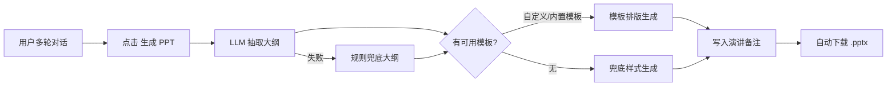
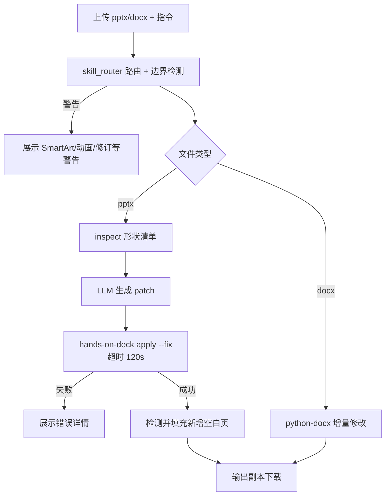
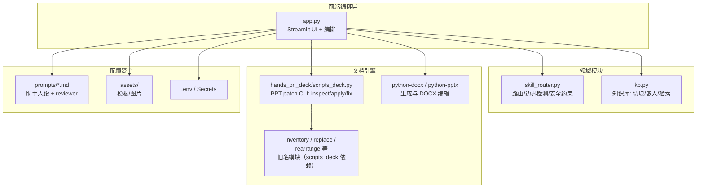

# 产品需求文档（PRD）：助手工作台（PM_assident）

| 项目 | 内容 |
| --- | --- |
| 产品名称 | 助手工作台（PM_assident） |
| 当前版本 | v0.9（MVP 测试版） |
| 文档类型 | 开发交接文档 |
| 更新日期 | 2026-08-28 |
| 部署形态 | 本地 Streamlit / Streamlit Cloud（经 GitHub 部署） |
| 代码入口 | `app.py` |

---

## 1. 产品概述

### 1.1 背景与问题

产品经理（及项目型岗位）日常存在大量"对话产出 → 正式文档"的转化工作：与 AI 讨论形成的需求分析、方案思路，仍需手工整理成 PPT 汇报稿、Word 方案文档，且经常需要对既有文档做增量修改。通用聊天产品只给文本，无法直接产出可交付的办公文档；手工排版与重复誊抄耗时且易错。

### 1.2 产品定位

一个基于 Streamlit 的 **AI 办公助手工作台**：以"角色化助手 + 多话题对话"为核心，把大模型对话与 PPT/Word 的**生成、编辑、知识增强**打通，实现"对话即产出、上传即可改"。

核心差异点：

1. **角色可配置**：助手人设由 `prompts/` 目录下的 Markdown 文件驱动，新增角色零代码。
2. **文档双向能力**：既能从对话生成 PPT/Word，也能对上传的既有 PPT/Word 做自然语言增量编辑（只输出副本，绝不覆盖源文件）。
3. **每助手独立知识库（RAG）**：对话自动检索本助手知识库，回答可基于私有资料。
4. **安全路由层**：上传文件先经路由与边界检测（SmartArt/动画/修订标记等），不可脚本修改的元素提前警告。
5. **自我审查**：助手每次回复可自动做质量审查，结果可展开查看。

### 1.3 产品目标（MVP 验证点）

| 目标 | 验证方式 |
| --- | --- |
| 对话一键产出可交付 PPT | 用户点击"生成 PPT"可下载套用模板的 .pptx（含演讲备注） |
| 既有文档增量修改可用 | 上传 .pptx/.docx + 自然语言指令，输出修改后的副本 |
| 私有知识可注入回答 | 上传资料入库后，相关提问能命中知识库内容 |
| Streamlit Cloud 可稳定运行 | 经 GitHub 推送后在线可用，密钥走 Secrets 管理 |

### 1.4 验收目标（量化基线）

用于 MVP 验收与后续迭代的量化指标：

| 验收指标 | 现状（人工） | 目标值 |
| --- | --- | --- |
| PPT 首稿平均制作时间 | 60 min | ≤ 10 min |
| Word 修改平均耗时 | 30 min | ≤ 5 min |
| 知识库回答引用准确率 | — | ≥ 85% |
| 文档修改任务一次成功率 | — | ≥ 80% |

---

## 2. 目标用户与角色

### 2.1 终端用户

| 用户画像 | 典型诉求 |
| --- | --- |
| 产品经理 | 需求分析、方案讨论 → 汇报 PPT / 方案 Word；对既有汇报材料做局部修改 |
| 项目型岗位（如药监局项目助手场景） | 基于项目资料库问答，产出项目文档 |
| 其他知识工作者 | 通过新增 `prompts/*.md` 自定义助手角色复用整套能力 |

### 2.2 系统内置角色（可配置）

- 助手角色由 `prompts/` 目录自动扫描（`*.md`，`reviewer.md` 除外），当前内置：
  - **产品经理助手**（`prompts/产品经理助手.md`）
  - **药监局项目助手**（`prompts/药监局项目助手.md`）
- 每个文件包含系统提示词与开场问候语（由 `_extract_greeting` 解析）。
- **审查员角色**：`prompts/reviewer.md`，供 Agent 自我审查使用，不出现在助手选择列表。
- 每个助手拥有**独立的会话话题与知识库**，互不串扰。

---

## 3. 用户故事

| # | 用户故事 | 验收标准 |
| --- | --- | --- |
| US-1 | 作为产品经理，我想与助手多轮讨论需求并保留多个话题 | 侧边栏可新建/重命名/删除话题，刷新后仍在（`history_topics.json`） |
| US-2 | 作为产品经理，我想把助手最新回复一键变成汇报 PPT | 点击"生成 PPT"，10~30 秒内产出套模板的 .pptx，含演讲备注，可下载 |
| US-3 | 作为产品经理，我想把整个话题导出为 Word | 点击"导出 Word"，产出按对话轮次组织的 .docx |
| US-4 | 作为产品经理，我想用一句话修改已有 PPT | 上传 .pptx + 指令（如"把标题改成 X，末尾加一页总结"），输出修改副本 |
| US-5 | 作为产品经理，我想用一句话修改已有 Word | 上传 .docx + 指令，输出修改副本 |
| US-6 | 作为项目成员，我想把项目资料喂给助手后再提问 | 知识库上传入库后，提问自动检索命中内容参与回答 |
| US-7 | 作为使用者，我想在对话中直接附上文件提问 | 输入框支持多附件（txt/md/pdf/docx/pptx/xlsx），内容抽取后注入上下文 |
| US-8 | 作为使用者，我想知道助手回答的质量如何 | 开启自我审查后，每条回复下可展开"自我审查结果" |
| US-9 | 作为管理员，我想零代码新增一个助手角色 | 在 `prompts/` 放入新的 .md 文件即可出现在"当前助手"下拉框 |

---

## 4. 功能需求

优先级：P0 = MVP 必备；P1 = 重要；P2 = 增强。状态均为"已实现"。

### 4.1 助手与话题管理（P0）

| 需求 | 说明 |
| --- | --- |
| 助手切换 | 侧边栏"当前助手"下拉，来源为 `prompts/*.md`（排除 `reviewer.md`）；切换后加载对应系统提示词、问候语与知识库 |
| 话题管理 | 每个助手独立话题列表：新建、重命名（限 30 字符）、删除；当前话题标记 🟢，其余 💬 |
| 话题持久化 | 话题与消息落盘 `history_topics.json`；空话题自动清理（最多保留 1 个） |
| 问候语 | 新话题首屏展示助手文件中的 GREETING（不计入对话历史） |

### 4.2 大模型接入与选择（P0）

| 需求 | 说明 |
| --- | --- |
| 双供应商 | DeepSeek/OpenAI 兼容接口（`OPENAI_*` 配置）+ 通义千问（复用 `EMBEDDING_*` 密钥与地址，模型名 `QWEN_MODEL`） |
| 运行时切换 | 侧边栏"当前大模型"下拉；未配置任何密钥时给出配置指引且不崩溃 |
| 客户端缓存 | `st.cache_resource` 缓存 OpenAI client，避免重复建连 |

### 4.3 对话与附件（P0）

| 需求 | 说明 |
| --- | --- |
| 多轮对话 | 系统提示词 + 历史轮次注入；历史上限 `MAX_HISTORY_ROUNDS`（默认 10 轮）、`MAX_HISTORY_CHARS`（默认 8000 字符） |
| 对话框附件 | `st.chat_input` 支持多文件；类型：txt、md、pdf、docx、pptx、xlsx |
| 文本抽取 | `extract_text` 分格式抽取（pypdf / python-docx / python-pptx / openpyxl），单文件注入上限 `MAX_UPLOAD_CHARS`（8000 字符），超限截断并标注 |
| 仅附件无文字 | 自动转为"请结合我上传的附件内容进行回答" |

### 4.4 知识库 RAG（P1）

| 需求 | 说明 |
| --- | --- |
| 按助手隔离 | 每助手独立存储 `kb_store_{助手名}.json` |
| 入库 | 支持多文件批量入库；切块 `KB_CHUNK_SIZE=700` / 重叠 `KB_CHUNK_OVERLAP=100`；同名文档覆盖更新（**先向量化成功再删旧条目**，失败不丢数据） |
| 检索 | BM25 + 向量双通道，`KB_TOP_K=4`、`KB_MIN_SCORE=0.25`；可选 `RERANK_MODEL` 重排（候选 `RERANK_CANDIDATES=20`） |
| 存储格式 | 向量以 base64+struct 压缩存储；加载时自动迁移为 list，损坏数据整体容错降级为空库 |
| 管理 | 侧边栏知识库 expander：入库、按文档删除、清空；未配置嵌入服务时禁用并提示 |
| 对话注入 | 每次提问自动检索，命中内容注入上下文 |

### 4.5 PPT 生成（P0）

| 需求 | 说明 |
| --- | --- |
| 入口 | 主区操作条"📊 生成 PPT"（需存在助手非问候回复且已配置模型） |
| 流程 | 最新回复 → LLM 大纲抽取（失败时用规则兜底大纲）→ 排版生成 |
| 模板 | 优先用户侧边栏上传的自定义模板（会话内缓存），否则使用内置模板（`assets/me.pptx`，6 页版式：封面/目录/内容/双栏等），无模板时走默认企鹅奶油风兜底样式 |
| 演讲备注 | 每页生成 speaker notes |
| 交付 | 生成后自动触发浏览器下载，同时保留下载按钮；文件名取话题标题（≤20 字符） |

### 4.6 Word 导出（P1）

- 主区操作条"📤 导出 Word"：把当前话题完整对话（用户/助手轮次）导出为 .docx；生成后自动触发下载。

### 4.7 文档编辑模式（P0，核心差异化）

位置：侧边栏"🛠️ 编辑已有文档"。上传 .pptx/.docx + 自然语言指令，**只输出副本，永不覆盖源文件**。

**4.7.1 路由与边界检测（`skill_router.py`，零 Streamlit 依赖）**

| 能力 | 说明 |
| --- | --- |
| 路由判定 | 按输入类型与扩展名判定 `generate_*` / `edit_*`；检测到 pptx/docx 自动切编辑链路并提示 |
| 安全约束 | 编辑链路强制 `output_mode=copy` |
| PPT 边界 | 检测 SmartArt、幻灯片动画 → 警告"无法修改/可能丢失" |
| DOCX 边界 | 检测修订标记（Track Changes）、复杂域代码（排除 PAGE/NUMPAGES/TOC）、密码保护（`<w:documentProtection`）→ 警告 |

**4.7.2 PPT 编辑链路**

1. `_deck_inventory`：调用 hands-on-deck CLI（`scripts_deck.py inspect --brief`，超时 60s）获取形状清单（每行：形状 id、类型、几何、文本预览）。
2. `_instruction_to_patch`：将指令 + 形状清单交给 LLM，生成符合真实 schema 的 patch 数组（slide 为 0-based 整数；形状引用 `sN` id；`replace-text` scope 仅 deck/slide/master；`add-slide` 用 `at`/`layout`；`set-notes` 用 `notes`）。
3. `_modify_pptx`：写入临时目录，经 `scripts_deck.py apply --fix` 执行（超时 120s，超时/失败记入 `last_deck_error`）。
4. Phase 2：`_post_process_new_slides` 检测新增空白页（识别图片/图表/表格等非文本形状，避免误判），用 LLM 按指令生成内容填充。
5. 输出副本供下载；失败时侧边栏提供"查看错误详情"。

**4.7.3 DOCX 编辑链路**

- `_modify_docx`：python-docx 增量修改（关键词定位替换、段落后插入新段落——继承锚点段落属性、文本单次写入），输出副本。

### 4.8 Agent 自我审查（P1）

| 需求 | 说明 |
| --- | --- |
| 开关 | 侧边栏"Agent 自我审查" expander，默认开（`REVIEW_ENABLED`） |
| 审查模型 | `REVIEWER_MODEL` 留空则复用当前对话模型；温度 `REVIEW_TEMPERATURE=0.3` |
| 提示词 | `prompts/reviewer.md`（准确性/完整性/合规性等维度） |
| 展示 | 每条助手回复下"🔍 自我审查结果" expander |

### 4.9 UI 与主题（P2）

- 宽布局，企鹅吉祥物头像（`assets/penguin.jpg`）；暖色主题（`.streamlit/config.toml`：主色 `#f2b95c`、背景 `#fdf6ec`）；自定义样式 `styles/app.css`。

---

## 5. 关键交互流程

### 5.1 对话生成 PPT



### 5.2 文档编辑



---

## 6. 非功能需求

| 类别 | 需求 |
| --- | --- |
| 性能 | 单轮对话响应取决于所选模型；PPT 生成 10~30s；PPT patch 应用 ≤120s（超时自动终止并报错）；inspect 清单 ≤60s |
| 安全 | 编辑链路只输出副本；密钥仅存 `.env`（本地）/ Streamlit Secrets（线上），`.gitignore` 排除敏感文件；上传解析异常全部捕获不崩溃 |
| 可用性 | 未配置模型/嵌入服务时给出明确指引而非报错白屏；知识库损坏自动降级为空库 |
| 可配置性 | 全部关键参数支持环境变量覆盖（见 §8.2），无需改代码 |
| 部署约束 | 兼容 Streamlit Cloud：无状态运行时、依赖经 `requirements.txt` 安装、hands-on-deck 以子进程调用（`sys.executable`，无需额外安装） |
| 兼容性 | Python ≥3.11（本地开发 3.14）；`requirements.txt`：openai、python-dotenv、streamlit、pypdf、python-docx、python-pptx、openpyxl、Pillow |

---

## 7. 技术架构



### 7.1 模块职责

| 模块 | 职责 | 说明 |
| --- | --- | --- |
| `app.py` | UI 与全流程编排 | 侧边栏（助手/话题/模型/编辑/模板/知识库/审查）、对话、生成、编辑 |
| `skill_router.py` | 统一前置判断 | 纯 Python 零 Streamlit 依赖；`detect_route` 返回 `RouteDecision`（route/warnings/safety/boundary_warnings） |
| `kb.py` | 知识库 | 纯 Python 零 Streamlit 依赖；切块、嵌入、BM25+向量检索、可选重排、持久化 |
| `hands_on_deck/scripts_deck.py` | PPT 结构编辑引擎 | 第三方 CLI：`inspect --brief`（形状清单）、`apply`（patch 应用 + 预检整批拒绝）、`fix`（几何修复） |
| `prompts/` | 角色资产 | 助手人设（含问候语）与审查员提示词 |
| `pm_agent.py` | 历史 CLI 形态 | 已被 Web 版取代，保留不维护 |

---

## 8. 数据与配置

### 8.1 持久化数据

| 文件 | 内容 | 注意 |
| --- | --- | --- |
| `history_topics.json` | 各助手话题与消息 | Streamlit Cloud 重部署/重启会重置 |
| `kb_store_{助手名}.json` | 知识库（文本块 + 压缩向量） | 同上 |
| `.env` | 密钥与参数 | 不入库；线上用 Settings → Secrets |

### 8.2 环境变量

| 变量 | 默认值 | 用途 |
| --- | --- | --- |
| `OPENAI_API_KEY` / `OPENAI_BASE_URL` / `MODEL_NAME` | 空 / `https://api.openai.com/v1` / `gpt-4o-mini` | DeepSeek（OpenAI 兼容）对话模型 |
| `EMBEDDING_API_KEY` / `EMBEDDING_BASE_URL` | 空 / OpenAI 兼容地址 | 嵌入服务；同时作为通义千问对话模型密钥 |
| `EMBEDDING_MODEL` | `text-embedding-3-small` | 嵌入模型名 |
| `QWEN_MODEL` | `qwen3.8-max` | 通义千问对话模型名 |
| `RERANK_MODEL` / `RERANK_CANDIDATES` | 空 / `20` | 检索重排（可选） |
| `KB_CHUNK_SIZE` / `KB_CHUNK_OVERLAP` | `700` / `100` | 切块参数 |
| `KB_TOP_K` / `KB_MIN_SCORE` | `4` / `0.25` | 检索召回与阈值 |
| `EMBEDDING_BATCH_SIZE` | `10` | 嵌入批量 |
| `MAX_HISTORY_ROUNDS` / `MAX_HISTORY_CHARS` | `10` / `8000` | 对话历史注入上限 |
| `REVIEW_ENABLED` / `REVIEWER_MODEL` / `REVIEW_TEMPERATURE` | `true` / 空（复用对话模型）/ `0.3` | 自我审查 |

---

## 9. 已知限制与边界（v0.9）

| # | 限制 | 现状处理 |
| --- | --- | --- |
| 1 | SmartArt、幻灯片动画无法脚本修改 | 上传时边界检测并警告 |
| 2 | DOCX 修订标记/复杂域/密码保护 | 检测并警告，不保证修改正确 |
| 3 | PPT 新增页内容需两阶段（先空白页后 LLM 填充） | 已实现自动填充；填充质量依赖模型 |
| 4 | `replace-text` 仅处理单 run 内文本，跨 run 文本替换会报错 | patch 生成提示词引导改用 `set-text` |
| 5 | 对话附件注入截断 8000 字符 | 超长资料建议入库知识库 |
| 6 | Streamlit Cloud 文件非持久 | 话题/知识库重部署后重置（见路线图） |
| 7 | 知识库嵌入依赖外部服务 | 未配置时功能禁用并提示 |

---

## 10. 路线图（MVP 之后）

### 短期（P1）

- **patch 预览确认**：执行前展示 LLM 生成的 patch 供用户确认/手改，降低误改风险。
- **检索溯源展示**：对话中展示知识库命中片段与来源文档，增强可信度。
- **DOCX 编辑能力扩展**：支持更多指令类型（标题层级调整、表格增删）。

### 中期（P2）

- **多轮编辑上下文**：编辑指令支持指代上一次修改（"再把刚才那页标题改大"）。
- **Excel 产出**：数据类回复一键导出 .xlsx。
- **持久化迁移**：话题与知识库迁移至外部存储（如云数据库），解决 Streamlit Cloud 重置问题。

### 长期（P3）

- 团队协作：话题/文档分享与评论。
- 文档版本对比（编辑前后 diff 可视化）。
- 审查报告导出与合规留痕。

---

## 11. 附录

### 11.1 启动与验证

```powershell
pip install -r requirements.txt
python -m streamlit run app.py --server.headless true --browser.gatherUsageStats false
```

验证基线（v0.9 已通过）：

- `python -m py_compile app.py skill_router.py kb.py pm_agent.py hands_on_deck/scripts_deck.py`
- `python hands_on_deck/scripts_deck.py assets/me.pptx inspect --brief`

### 11.2 目录结构（关键部分）

```
PM_assident/
├── app.py                  # Streamlit 主程序（UI + 编排）
├── skill_router.py         # 路由 / 边界检测 / 安全约束
├── kb.py                   # 知识库 RAG
├── prompts/                # 助手人设与审查员提示词
├── hands_on_deck/          # PPT patch 编辑引擎（第三方）
├── assets/                 # 模板（me.pptx 等）与图片
├── styles/                 # 自定义 CSS
├── .streamlit/config.toml  # 主题配置
├── requirements.txt        # 依赖清单
└── history_topics.json / kb_store_*.json  # 运行时持久化
```
